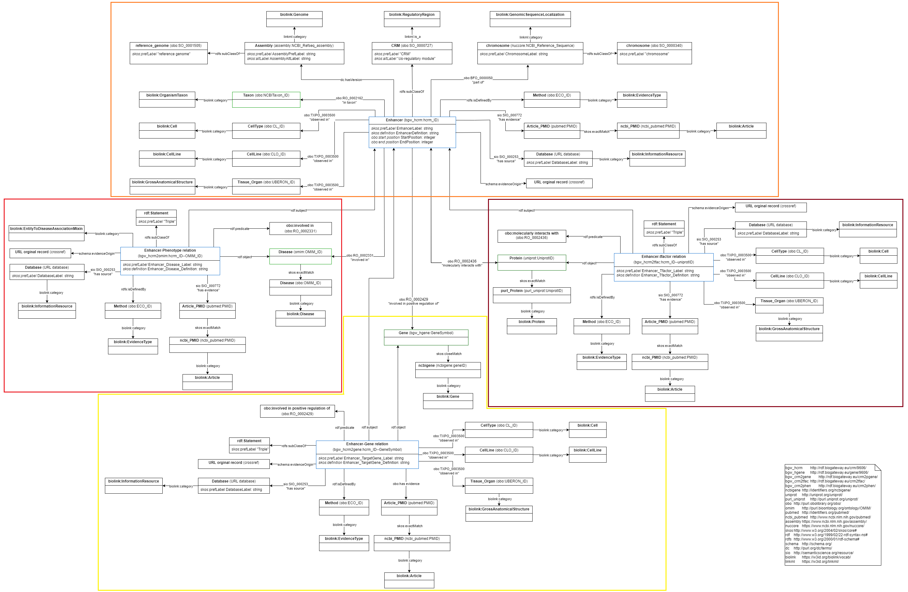
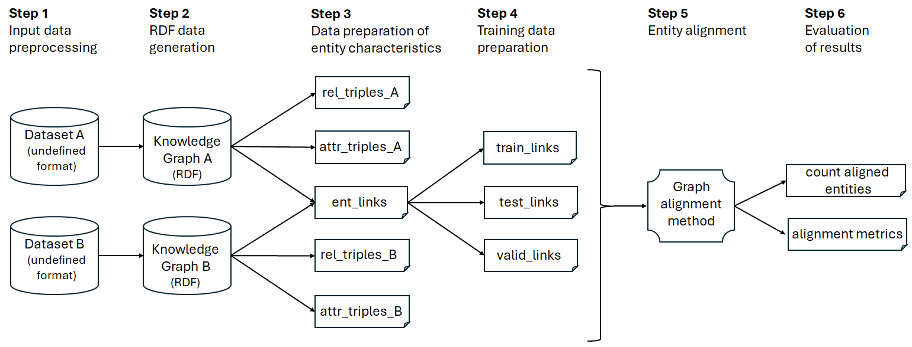

# Cis-Regulatory modules - Entity Alignment

## Introduction
Study of the performance of 20 entity alignment methods in knowledge graphs (KGs) about gene regulation domain, with a special focus on enhancer, the most studied cis-regulatory modules (CRM). These sequences were modeled using the [cisreg](https://github.com/juan-mulero/cisreg.git) schema, which was also used in [BioGateway](http://ssb4.nt.ntnu.no:23122/sparql) to integrate the data from 25 different sources. 

The following picture shows this schema used to model the information from different biological databases about enhancers and their relations with other entities. The colored boxes specify the different subgraphs or subdomains: enhancer sequences (crm graph - orange on the top), and their relations with other biological entities of interest, such as target genes (crm2gene graph - yellow on the bottom), transcription factors (crm2tfac graph - brown on the right), and phenotypes (crm2phen graph - red on the left). The blue classes constitute the central entities of each graph, while the green classes are biological classes of interest that were not modeled in detail because they are already present in the BioGateway KG, schema that is interoperable with this one.

We use this schema as a reference because so far we have not found another RDF schema for modeling these sequences, and their relationships with other entities. To align different KGs, we use different databases, i.e., with different sequences and relationships to other entities. We also performed alignments with modified attributes to introduce more variability. These alignment types are detailed later.

The twenty methods used for entity alignment are: AlignE, AliNet, AttrE, BootEA, BootEA-RotatE, GCN-Align, HolE, IMUSE, IPTranE, JAPE, MtransE, ProjE, RDGCN, RSN4EA, RotatE, SimplE, TransD, TransH, TransR. In each run, two graphs (source and target) are aligned to find the common entities. The process of aligning entities from two different graphs generally involves: (1) extracting relevant features of the entities in the graphs (attributes and relations), (2) comparing the features to determine similarity or equivalence, and (3) assigning correspondences between entities that are considered similar or equivalent between graphs.

Each graph contains, in the form of RDF triples, the information belonging to different manually curated databases about enhancer sequences (the most studied type of CRM). The databases used as a sample, and corresponding to each of the aligned graphs, are:
- [ENdb](http://www.licpathway.net/ENdb/index.php)
- [EnDisease](https://health.tsinghua.edu.cn/jianglab/endisease/)
- [DiseaseEnhancer](http://biocc.hrbmu.edu.cn/DiseaseEnhancer/)
- [VISTA](https://enhancer.lbl.gov/)
- [RefSeq](https://ftp.ncbi.nlm.nih.gov/refseq/H_sapiens/)

Since the [databases](./datasets.rar) contain different types of biological entities that can be modeled in different graphs, a study of the performance of the methods using all domains or graphs (all), and different subdomains (crm, crm2gene, crm2phen and crm2tfac) was also carried out.

## Types of pairwise alignments

Different use cases were studied to explore the performance against different scenarios. Alignments of identical graphs ([AvsA](./AvsA/)) and alignments of different graphs at various levels: at attribute level ([AvsA'](./AvsA'/)), at edge level ([AvsB](./AvsB/) and [mod_AvsB](./mod_AvsB/)), and at attribute and edge level ([A'vsB'](./A'vsB'/)).

 - In AvsA alignment, two identical graphs are compared. Since each graph represents the information of one database, the data of the database is aligned against itself. It is expected that this type of alignment gives the best possible alignment results. The results can be particularly useful to evaluate the performance of different alignment methods against a specific domain, with a certain model. However, the results could also be used for other purposes, like the evaluation of the database quality, or whether the semantic schema models the entities with a degree of detail that facilitates the adequate performance of the alignment methods.
 - In AvsA' type alignments the entities are the same real-world entities and have the same relationships, but they have different attributes. In the schema used, each CRM with unique coordinates is modeled as a different entity, and has a unique identifier. The 'definition' attribute of this entity is determined by the sequence coordinates, while its label derives from the identifier. This design is due to the lack of standard for naming CRM sequences. Therefore, sequences with the same coordinates have the same attributes. For this reason, in this alignment type we align equal databases in which the sequence names differ from each other, and for this we modify the identifiers of the sequences. The coordinates remain the same, because if they varied they would be different sequences.
 - In AvsB alignments, entities with different relationships but the same attributes are aligned. That is, CRM sequences hosted in different databases are aligned. Since not all databases have enough common entities, a methodological variant was implemented to carry out these alignments (modified AvsB). In short, both databases are merged to generate a larger graphs (A+B vs B+A). The proper entities from each database are used for training and validation, while the common ones are used for testing. Therefore, the common entities, which can be reduced, do not need to be split up, but can be used to evaluate the performance of the method to align distinct entities from two different datasets. 
 - In A'vsB' type alignments, both the relationships and the attributes of the entities are different. As in AvsB type alignments, sequences from different databases are aligned, but in this case the names of the sequences are also different. Also like in the AvsA' case, we did not modify the attributes associated with the coordinates of the sequences because this would generate different entities. 

## Workflow
To carry out the experiments, a standardised workflow based on the [cisreg](https://github.com/juan-mulero/cisreg.git) and [OpenEA](https://github.com/nju-websoft/OpenEA.git) packages was followed.

1. **Step 1 - Preproccesing**: The original database files are pre-processed using [dataset-specific codes](https://github.com/juan-mulero/cisreg/tree/main/Rcodes) to standardize the data input in the automatic generation of RDF files. For example, EnDisease and RefSeq database annotate enhancers using the hg38 reference genome, but ENdb, DiseaseEnhancer and VISTA use the hg19 assembly. Sequences of different assemblies are not directly comparable, so all sequences were remapped using the later hg38 assembly and the [liftOver](https://bioconductor.org/packages/liftOver/) package. Other operations were carried out to facilitate the execution of an automatic workflow for the subsequent RDF files generation, but they differ according to the dataset due to the specific features of each source, so we refer the users to the respective codes.
2. **Step 2 - RDF data generation**: [Generation of RDF files](https://github.com/juan-mulero/cisreg/tree/main/cisreg) that will constitute the different graphs. These files have been included in ['datasets'](./datasets.rar). Each graph contains, in the form of triples, the data stored in each database used as sample. Since each database also contains different biological subdomains, graphs with all sudomains (all) and with specific subdomains were generated (crm, crm2gene, crm2phe and crm2tfac).
3. **Step 3 - Data preparation of entity characteristics**: Preparation of the input data. Three kinds of files for each pairwise alignment: one file for the attributes of the entities of each graph, one file for the relationships, and other for the entities. The 'processingRDF.R' codes used are stored in the folders for each use case tested ([AvsA](./AvsA/), [AvsA'](./AvsA'/), [AvsB](./AvsB/), [mod_AvsB](./mod_AvsB/), [A'vsB'](./A'vsB'/)).
4. **Step 4 - Training data preparation**: It is also part of the preparation of the input data. The alignment methods require a previous training based on a seed alignment. Therefore, the entity file (ent_links), where the entities of both graphs are linked, is randomly divided into three subsets for training, testing and validation in a ratio 7:2:1 respectively. This task is performed through the 'randomPairs.py' code included in each use case. When this file is not present, the subdivision is part of the previous preprocessing process due to a reduced number of common entities that prevents that this subdivision ratio is effective.
5. **Step 5 - Entity alignment**: Pairwise alignment using the previously generated input files, and the 20 different methods indicated above under their default configuration. The [OpenEA](https://github.com/nju-websoft/OpenEA.git) package was used for this run and, although OpenEA offers a total of 25 methods, we discarded 5 of them mainly due to the high error rate obtained with this default configuration and input data. To provide more statistical significance, each alignment was executed in duplicate using two different samples, i.e. same KGs, but different distribution of entities between the training, testing and validation subsets. We also set a memory limit of 250 GB, and a time limit of 48h to start the entity alignment processes after the launch.
6. **Step 6 - Evaluation of results**: We analyze the results of the metrics returned by the entity alignments to identify the best performing methods, with a special focus on the hits@1 and execution time values, and we count the number of aligned entities per biological entity type to identify the performance per entity type. The codes corresponding to the generation of statistics are stored in the [scripts_metrics](./scripts_metrics/) folder. The files corresponding to the metrics are available in the 'metric' folders of each alignment type, while the files corresponding to the entity count are in the 'results' folders. Not all methods could complete a successful alignment in all the experiments performed. Error reports were also included in these cases.

## Metrics

We studied the metrics returned by OpenEA associated with each alignment (values hits@1, hits@5, hits@10, Mean ranking, Mean Reciprocal Ranking and Execution time), and with a special focus on the hits@1 and time values:

- The hits@1 metric indicates the percentage of cases where the correct entity is in the first k predictions generated by the model. These metrics are important to understand how often the model puts the right entity in the top ranking positions.
- The Mean Ranking (MR) is the mean of the positions of the correct entities in the ranking generated by the model. A lower MR score indicates a better performance of the model, as the correct entities are closer to the top of the ranking.
- Mean Reciprocal Ranking (MRR) is the mean of the reciprocals of the positions of the correct entities in the ranking. A higher MRR score indicates better performance, since it implies that the correct entities tend to be ranked higher.

Since we performed replicates for each alignment, variables of data variability were also studied (sd, var, cv), with a main emphasis on the CV values corresponding to the coefficients of variation.

## Results
Nearly 3000 executions are reported. The results are organized according to the type of alignment performed ([AvsA](./AvsA/), [AvsA'](./AvsA'/), [AvsB](./AvsB/), [mod_AvsB](./mod_AvsB/), [A'vsB'](./A'vsB'/)). 

Within each of these folders or type of alignment, the results corresponding to the alignment metrics are organized in the 'metric.rar' file, by graphs used in pairwise alignment (example: ENdb-EnDisease), domains used (ex: crm), and sample/replicate (ex: 1). 

The results corresponding to the performance of the alignment methods by type of biological entity follow a similar file structure. These are found in the 'results.rar' files and include an additional subdivision by alignment method used (example: AttrE). 

The files are zipped due to the high number of files included and for easier storage. Note that only the results used for the evaluation are included, also for space reasons..

The [Supplementary Tables](./Supplementary_material_Tables.xlsx) and [Supplementary Figures](./Supplementary_material_Figures.pdf) files contain additional material that supports the main text of the manuscript.

